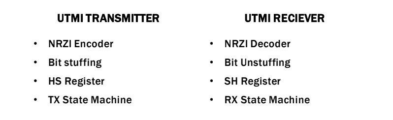
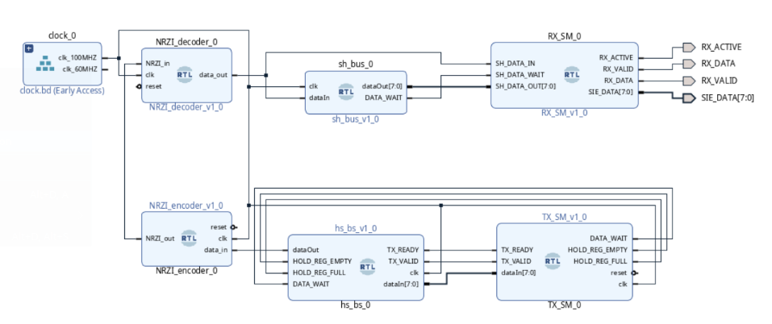
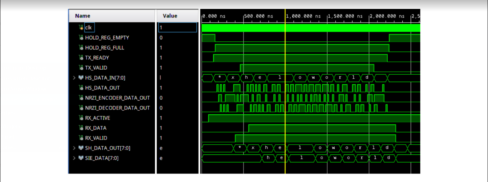

# Universal Transeiver Macrocell Interface 

This project is done as part of the System on Programmable Chip Lab course. It demostrates the working of a basic UTMI using Verilog. 

# Implementation

# Block Diagram

# Test Results

HS_DATA_IN: Input data given to UTMI Transmitter

SH_DATA_OUT: Output data from UTMI Reciever

SIE_DATA: Data after headers being stripped